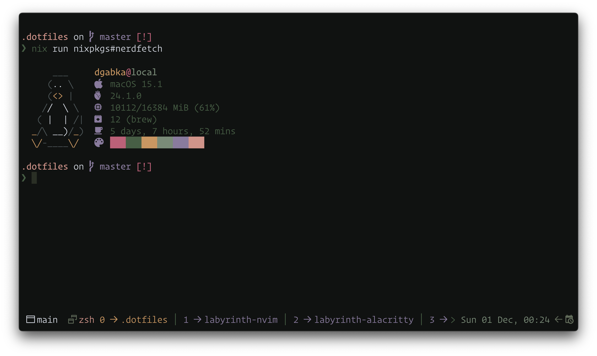

# Labyrinth

## Usage

1. Locate (or create) Alacritty's config file (refer to [the *Configuration* section of Alacritty's readme](https://github.com/alacritty/alacritty/tree/master#configuration))
2. Clone this repository
3. Copy the contents of the `dist/` directory to a location of your choosing
4. Import **one** of the TOML files you just copied into Alacritty's config

### Example

The following example will assume that your Alacritty's config path is `~/.config/alacritty/alacritty.toml`.

```sh
# Clone this repository
git clone https://github.com/dgabka/labyrinth-alacritty.git

# Copy the contents of the `dist` directory to Alacritty's config directory
cp ./labyrinth-alacritty/dist/* ~/.config/alacritty

# Delete the cloned repository (optional)
rm -r ./labyrinth-alacritty
```

Import one of theme variants into your Alacritty's config:

```toml
import = ["~/.config/alacritty/labyrinth-dusk.toml"]
```

## Gallery

Fetch featured below is [NerdFetch](https://github.com/thatonecalculator/nerdfetch)

**Labyrinth Dusk**



**Labyrinth Shade**


