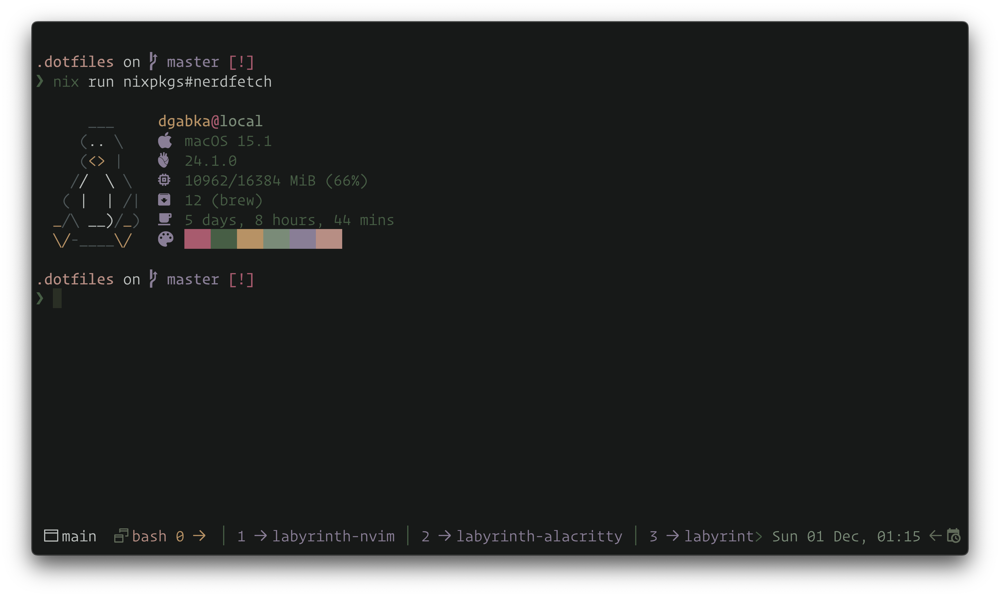

# 🌿 Labyrinth

Discover Labyrinth, a serene color scheme inspired by hidden pathways and mossy landscapes. Let its gentle tones guide your creativity with calm elegance.

Labyrinth provides four distinct variants with varying levels of contrast and color vibrancy to suit your preferences:

 - **Gloom**: The most contrasty variant, perfect for those who prefer sharp distinctions and vibrant colors.
 - **Dusk**: A balanced variant, offering a comfortable middle ground with moderate contrast and vibrancy.
 - **Mist**: The least contrasty variant, featuring the most gentle and subtle tones for a calm and unobtrusive interface.

Whether you're coding, designing, or simply exploring new aesthetics, Labyrinth adapts to your needs with its harmonious palette.

## Usage

1. Locate (or create) Alacritty's config file (refer to [the *Configuration* section of Alacritty's readme](https://github.com/alacritty/alacritty/tree/master#configuration))
2. Clone this repository
3. Copy the contents of the `dist/` directory to a location of your choosing
4. Import **one** of the TOML files you just copied into Alacritty's config

**Example**

The following example will assume that your Alacritty's config path is `~/.config/alacritty/alacritty.toml`.

```sh
# Clone this repository
git clone https://github.com/dgabka/labyrinth-alacritty.git

# Copy the contents of the `dist` directory to Alacritty's config directory
cp ./labyrinth-alacritty/dist/* ~/.config/alacritty

# Delete the cloned repository (optional)
rm -r ./labyrinth-alacritty
```

Import one of theme variants into your Alacritty's config:

```toml
import = ["~/.config/alacritty/labyrinth-dusk.toml"]
```

**Nix Home Manager**

```nix
let
  theme = pkgs.fetchFromGitHub {
    owner = "dgabka";
    repo = "labyrinth-alacritty";
    rev = "f6154f49e66c90df3e2dcc7f42efd44f7b8b5a2b";
    sha256 = "sha256-w6SoyJnG9nIzGJx5REZwI31f7SAxDNeBW2lY5IFbcIA=";
  };
in {
  programs.alacritty.settings.import = [ import "${theme}/dist/labyrinth-dusk.toml" ];
}
```

## Gallery

Fetch featured below is [NerdFetch](https://github.com/thatonecalculator/nerdfetch)

**Labyrinth Gloom**


**Labyrinth Dusk**


**Labyrinth Mist**



### Credits

Thanks to the [Rosé Pine](https://github.com/rose-pine) creators!
A special thanks to [Rosé Pine for Alacritty](https://github.com/rose-pine/alacritty) which this theme is based on.
